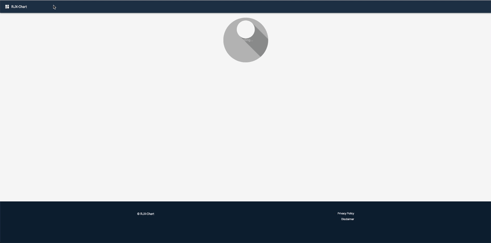

This project was bootstrapped with Create React App.

### <kbd>rjschart</kbd>

---------------

### `To install`
- open terminal and type: `git clone https://github.com/stefan22/rjschart.git`
- type: `cd rjschart`
- type: `npm install` (to install dependencies)
- type: `npm start` (to run local server in development mode)
- open `http://localhost:3000` to view it in the browser.

### `Npm test`
Launches the test runner in the interactive watch mode. (type: npm test)
See the section about running tests for more information.

### `Npm run build`
Builds the app for production to the build folder. (type: npm run build)
It correctly bundles React in production mode and optimizes the build for the best performance.

--------------------------

#### Doughnut ChartJS/React Data
- single page React component, Doughnut chart data graph with MaterialUI, Sass and ChartJS
- click on additional table to have it display in chart along with the original data.
Click again to go back to initial data graph display.

 

